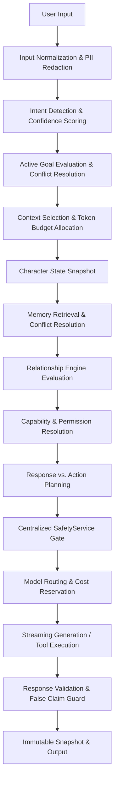

# ADVANCED CHARACTER RUNTIME ARCHITECTURE

## 1. Overview & Core Philosophy
Phase 25 establishes the next intelligence layer for the platform, ensuring characters become capable of structured, multi-turn reasoning and bounded task execution without ever morphing into unconstrained, autonomous agents.

### The Fundamental Separation of Concerns
| Component | Scope & Invariant |
| :--- | :--- |
| **Personality** | Defines **WHO THE CHARACTER IS** (identity, voice, boundaries, core values). |
| **Capabilities** | Defines **WHAT THE CHARACTER CAN DO** (allowed tools, rate limits, permission policies). |
| **Agent Runtime** | Defines **HOW THE CHARACTER COMPLETES A TASK** (step decomposition, checkpoints, confirmation gates). |
| **Memory** | Defines **WHAT THE CHARACTER KNOWS ABOUT THE USER** (facts, preferences, temporal decay). |
| **Relationship** | Defines **HOW THE USER-CHARACTER BOND EVOLVES** (stage, affection, emotional resonance). |
| **Social** | Defines **HOW THE CHARACTER INTERACTS ON THE PLATFORM** (feed, public sharing, community boundaries). |

---

## 2. Deterministic 14-Stage Generation Pipeline
Every user turn flows through a deterministic, observable sequence:

1. **Input Normalization**: Strips malicious prompt-injection markup, normalizes Unicode, checks basic rate limits.
2. **Intent Detection**: Analyzes input across 10 deterministic intent classes with confidence thresholds. If confidence `< 0.65`, safely falls back to casual conversation.
3. **Active Goal Evaluation**: Recovers active goals across multi-turn sessions without requiring conversation re-reading. Interrupted goals are safely paused.
4. **Context Selection**: Scores context candidates (conversation, memories, goals, knowledge chunks, tool results), applies recency/relevance heuristics, and enforces strict token budgets.
5. **Character State Snapshot**: Assembles immutable character identity, system behavior, and affect.
6. **Memory Retrieval**: Fetches relevant memories, applies temporal expiration (short-term facts expire automatically), and prioritizes newer explicit user statements over inferred statements.
7. **Relationship Engine**: Computes current intimacy, tone, and relationship stage boundaries.
8. **Capability Resolution**: Checks whether character, user consent, and platform permit target tools.
9. **Response vs. Action Planning**: Short-circuits standard chat when no tool is needed; prepares structured step plan if execution requested.
10. **Centralized SafetyService Gate**: Mandatory check before any model or tool invocation. Zero bypass allowed.
11. **Model Routing**: Selects optimal model based on latency, context size, cost, and availability. Reserves token budget.
12. **Generation / Execution**: Executes tool via `ToolExecutionGateway` or streams generation.
13. **Response Validation**: Validates character consistency, verifies that tool success is never fabricated, and formats output.
14. **Snapshot Capture**: Records an immutable `CharacterRuntimeSnapshot` for total post-hoc explainability.

---

## 3. Modular Character State
Rather than storing state in a monolithic blob, the runtime splits state into distinct relational and ephemeral layers:

* **Immutable Identity**: Core character definition, baseline system prompt, creator attribution (`Character`).
* **Published Configuration**: Versioned behavior policy, safety tier, and assigned capabilities (`CharacterVersion`).
* **Runtime State**: Active generation ID, stream connection, latency telemetry.
* **Conversational State**: Recent turns, current topic, sentence buffers.
* **Relationship Context**: User-character affinity, intimacy score, relationship stage (`UserCharacterRelationship`).
* **Temporary Affect**: Short-term mood, current conversation emotion (`CharacterEmotionalState`).
* **Active Goals**: Ongoing multi-turn objectives and constraint bounds (`UserGoal`).
* **Current Task**: Sandboxed execution plan, step checkpoints (`AgentTaskRecord`).
* **Capability State**: Assigned and consented tools (`CharacterSkill`, `UserToolConsentRecord`).

---

## 4. Immutable Runtime Snapshot & Reproducibility
For every generation, an immutable snapshot is recorded in PostgreSQL (`CharacterRuntimeSnapshot`):
* `characterVersionId`: Pinpoints exact character configuration.
* `promptVersionId`: Pinpoints system prompt template.
* `model`: Model identifier used for generation.
* `contextSnapshot`: Selected memory IDs, knowledge chunk IDs, and goal ID.
* `policyHash`: SHA-256 hash of active behavior and safety policies.
* `toolUsage`: Canonical record of any tools invoked during the generation.

Any historical generation can be fully explained via:
`GET /api/v1/agents/generations/:messageId/explain`
