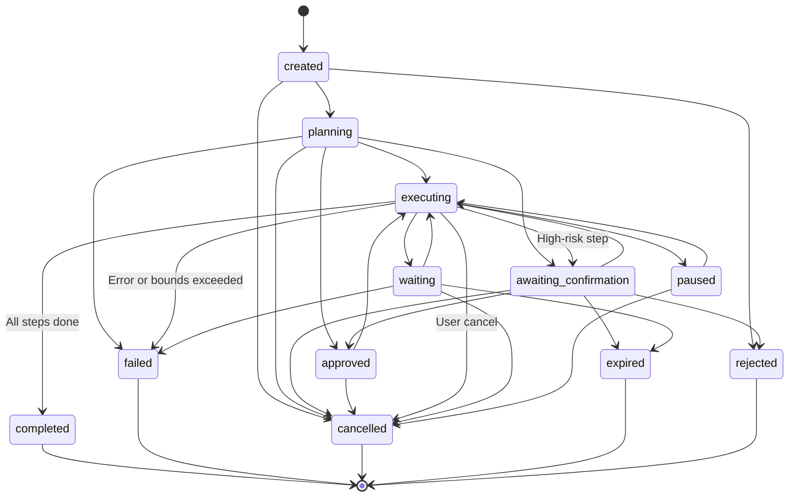

# AGENT EXECUTION ARCHITECTURE & TASK RUNTIME

## 1. Unified Agent Execution System
The platform operates a single, centralized agent execution system managed by `AgentTaskService`. No secondary or parallel agent engines exist.

### Core Architectural Guarantees
1. **Bounded Execution**: Every task enforces immutable upper limits:
   * Maximum Steps: `10`
   * Maximum Duration: `60,000 ms`
   * Maximum Model Cost: `$0.50 USD`
   * Maximum Retries: `2` (only on safe, idempotent operations)
2. **Durably Checkpointed**: Step results and execution state are recorded after every step in PostgreSQL (`AgentTaskCheckpoint`). If a worker crashes, execution resumes from the last completed checkpoint rather than re-executing completed operations.
3. **Cryptographic Action Binding**: High-risk actions require user confirmation bound to a canonical SHA-256 hash of tool arguments. Old or tampered tokens are rejected.
4. **Hard-Disabled Critical Actions**: Dangerous or sensitive actions (such as `payment.create` with code `PAYMENT_TOOL_DISABLED`) are permanently hard-disabled at the gateway level with zero bypass.

---

## 2. Agent Task State Machine
All agent tasks transition through a strictly enforced state machine (`AgentTaskStateMachine`):



---

## 3. Step Plan & Checkpoint Structure
A structured execution plan decomposes objectives into discrete, inspectable steps:

```json
{
  "taskId": "task_92384729-38f2-482a",
  "objective": "Research Tokyo hotel options under $150/night",
  "steps": [
    {
      "stepId": "step_1",
      "toolSlug": "search.web",
      "proposedArguments": { "query": "Tokyo hotels under 150 budget Shinjuku" },
      "riskLevel": "LOW",
      "status": "COMPLETED",
      "result": { "sources": ["hotel_tokyo_1", "hotel_tokyo_2"] }
    },
    {
      "stepId": "step_2",
      "toolSlug": "calendar.create_event",
      "proposedArguments": { "title": "Check hotel bookings", "date": "2026-10-01" },
      "riskLevel": "MEDIUM",
      "status": "AWAITING_CONFIRMATION",
      "confirmationToken": "conf_39fa082c...",
      "argumentsHash": "e3b0c44298fc1c149afbf4c8996fb92427ae41e4649b934ca495991b7852b855"
    }
  ],
  "bounds": {
    "maxSteps": 10,
    "maxDurationMs": 60000,
    "maxCostUsd": 0.50
  }
}
```

---

## 4. High-Risk Confirmation & Tamper Defense
When a step involves external mutations or elevated risk:
1. `HighRiskConfirmationService` generates a confirmation request.
2. The arguments are canonically sorted and hashed using `SHA-256`.
3. The user receives an action preview indicating:
   * Action name & target
   * Canonical parameters
   * Estimated cost
   * Reversibility status
4. When the user approves, `verifyAndConsume` recomputes the SHA-256 hash of the submitted arguments. If any parameter was altered, the confirmation is rejected with `ARGUMENT_TAMPERING_DETECTED`.
5. Tokens expire after 5 minutes (`300,000 ms`).

---

## 5. Cancellation & Worker Failure Handling
* **Cancellation**: Users can cancel any running or paused task via `POST /api/v1/agents/tasks/:id/cancel`. The status immediately transitions to `cancelled`, background worker jobs abort further steps, and reserved credits are refunded.
* **Worker Crash Recovery**: Periodic reconciliation monitors tasks stuck in `executing` without a heartbeat. The task is recovered using its last safe checkpoint stored in `AgentTaskCheckpoint`.
