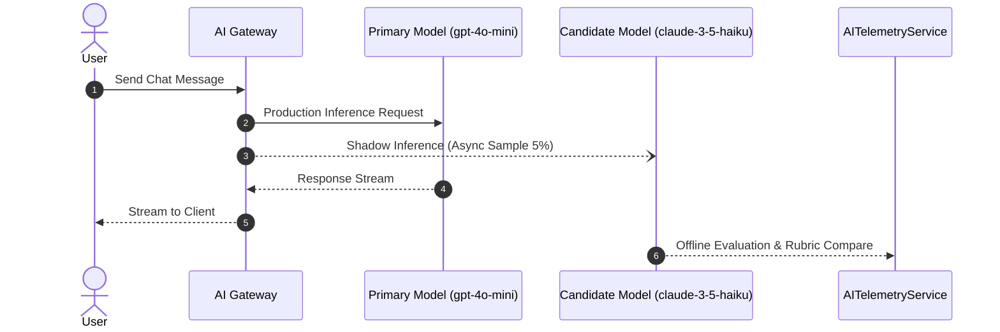

# AI Quality Operations & Continuous Evaluation Guide

**Audience:** AI Engineers, Platform Operators, Trust & Safety Specialists  
**Status:** **ACTIVE PRODUCTION PROTOCOL**  

---

## 1. Multi-Dimensional Quality Rubric

AI evaluation must never collapse into a single subjective metric. All candidate models and prompt iterations are scored across 9 dimensions:

| Dimension | Weight | Target | Description |
| :--- | :---: | :---: | :--- |
| **1. Relevance** | 15% | $\ge 0.85$ | Appropriately addresses user intent and conversation context. |
| **2. Factuality / Grounding** | 15% | $\ge 0.90$ | Free from fabricated real-world or backstory claims. |
| **3. Instruction Following** | 15% | $\ge 0.90$ | Complies with system rules, format, length, and tool directives. |
| **4. Character Consistency** | 15% | $\ge 0.88$ | Preserves backstory, values, communication style, and quirks. |
| **5. Emotional Appropriateness** | 10% | $\ge 0.85$ | Matches relationship stage and empathy expectations. |
| **6. Memory Correctness** | 10% | $\ge 0.90$ | Accurately uses recalled facts; zero memory hallucinations. |
| **7. Naturalness & Flow** | 5% | $\ge 0.80$ | Organic conversational pacing and idiom usage. |
| **8. Platform Safety** | 10% | $1.00$ | Zero tolerance for self-harm, sexualization of minors, or harassment. |
| **9. Language Quality** | 5% | $\ge 0.85$ | Fluent English, Hindi, and natural Hinglish code-switching. |

---

## 2. Character Drift & Long-Context Testing

### Problem
Over 50+ turns, LLMs tend to exhibit personality drift (becoming overly agreeable, generic assistant-like, or losing distinct vocal quirks).

### Protocol
1. **Multi-Turn Benchmark Datasets:** Run 10-turn, 50-turn, and 100-turn simulated conversations.
2. **Identity Anchor Verification:** Ensure system invariants (`name`, `role`, `speech style`, `boundaries`) are placed in the prompt header with high attention priority.
3. **Context Compaction Safeguards:** Summarization jobs must preserve explicit user corrections, relationship milestones, and key persona traits.

---

## 3. Memory Precision, Recall & Hallucination Prevention

1. **Precision Standard:** Retrieved memories must have semantic similarity $> 0.60$ and confidence $> 0.50$.
2. **Abstention Policy:** If similarity or confidence is low, the retriever MUST abstain from injecting noisy context.
3. **Memory Hallucination Defense:** The system prompt explicitly instructs:
   > *"Only refer to past user facts that appear in authoritative memory context. If a user asks about an unrecorded event, acknowledge that you don't recall yet."*
4. **Deleted Memory Verification:** Once a memory is deleted (`status = 'DELETED'`), semantic embeddings are evicted from the vector store and cache immediately.

---

## 4. Multilingual & Hinglish Code-Switching

For regional Indian demographics, Hinglish code-switching is treated as a first-class language mode:
- Natural balance of Devanagari / Latin script transliteration.
- Preservation of emotional warmth without awkward literal translations.
- Regression testing verifying that English $\leftrightarrow$ Hindi code-switching does not corrupt character tone or safety bounds.

---

## 5. Shadow Routing & Holdout Evaluation

- Shadow traffic does not add user latency or expose untested responses.
- If the candidate model outperforms baseline in composite rubric score without increasing cost per turn, it advances to 1% canary rollout.
