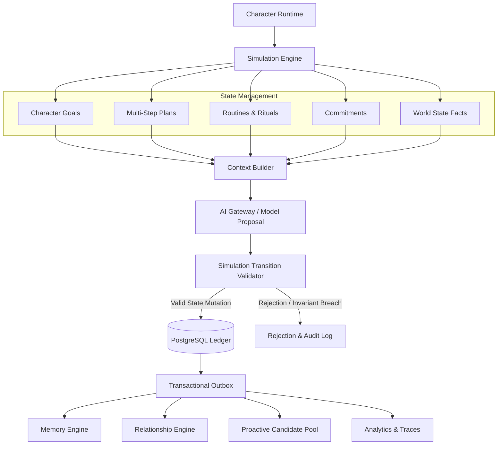

# CHARACTER SIMULATION ARCHITECTURE

## 1. System Overview

The **Character Simulation Layer** manages long-horizon behavioral state across days, weeks, and months. It provides deterministic state machines for character objectives, multi-step plans, timezone-aware routines, grounded commitments, and persistent fictional world facts.



---

## 2. Core Architectural Principles

1. **State Authoritativeness**: The platform is the single source of truth for character state. The LLM generates behavioral proposals; the platform validates constraints, invariants, and policies before committing state transitions to PostgreSQL.
2. **Deterministic Pre-Checks**: LLM calls are skipped when deterministic conditions indicate no action is needed (e.g., quiet hours, active cooldowns, no pending routines, or user-disabled proactive settings).
3. **Strict Bounded Autonomy**:
   - `PASSIVE`: State is queried only when the user sends a message.
   - `CONTEXTUAL`: State informs reply generation context; zero proactive outreach.
   - `PROACTIVE`: Generates candidate intents dispatched to ProactiveEngine for fatigue/quiet-hour filtering.
   - `TASK_ORIENTED`: Coordinates with Agent Runtime for external tool workflows with user consent.
4. **Source Authority Hierarchy**:
   ```text
   EXPLICIT_USER_STATEMENT
     > CURRENT_SYSTEM_STATE
     > VERIFIED_TOOL_RESULT
     > RECENT_CONVERSATION
     > VALIDATED_MEMORY
     > SIMULATION_INFERENCE
     > MODEL_INFERENCE
   ```

---

## 3. Component Taxonomy

### 3.1 Time Context Service (`CharacterTimeContextService`)
- Resolves server-authoritative timestamps, localized dates, day of week, and time-of-day classifications (`MORNING`, `AFTERNOON`, `EVENING`, `NIGHT`).
- Resolves user timezone hierarchy: `Explicit Profile > Device Header > Default UTC`.
- Enforces user-configured quiet hours (default: 22:00 to 08:00 local time).

### 3.2 Goals & Multi-Step Plans (`CharacterGoalService`, `CharacterPlanService`)
- **Goals**: High-level long-horizon objectives categorized by `PERSONAL_DEVELOPMENT`, `CREATIVE`, `KNOWLEDGE`, `PROJECT`, `CONVERSATIONAL`, and `RELATIONSHIP_CONTEXT`.
- **Plans**: Directed sequence of bounded steps with prerequisite dependencies (`dependencies: JsonB`), step statuses (`PENDING`, `IN_PROGRESS`, `COMPLETED`, `SKIPPED`, `BLOCKED`), and completion criteria.

### 3.3 Routines & Rituals (`CharacterRoutineService`, `SimulationSchedulerService`)
- Manages recurring schedules defined via standard cron syntax.
- Bounded catch-up policy (`maxCatchUpOccurrences: 1`) prevents thundering herd execution after worker restarts or downtimes.
- Distributed locking via Redis prevents concurrent execution across horizontal worker nodes.

### 3.4 Persistent World State (`CharacterWorldStateService`)
- Manages persistent facts regarding ongoing fictional projects, settings, items, and environment states.
- Supports both global character lore and user-scoped fictional continuity.
- Emits immutable events to `CharacterWorldStateEvent` for full state reconstructibility.

### 3.5 Proposal Validator & State Migrations (`SimulationProposalValidator`, `SimulationStateMigrator`)
- Validates model proposals against schema, ownership, safety, and evidence requirements.
- Governs character version upgrades (`characterVersionId`) with dry-run support, schema compatibility checks, and rollback safety.
