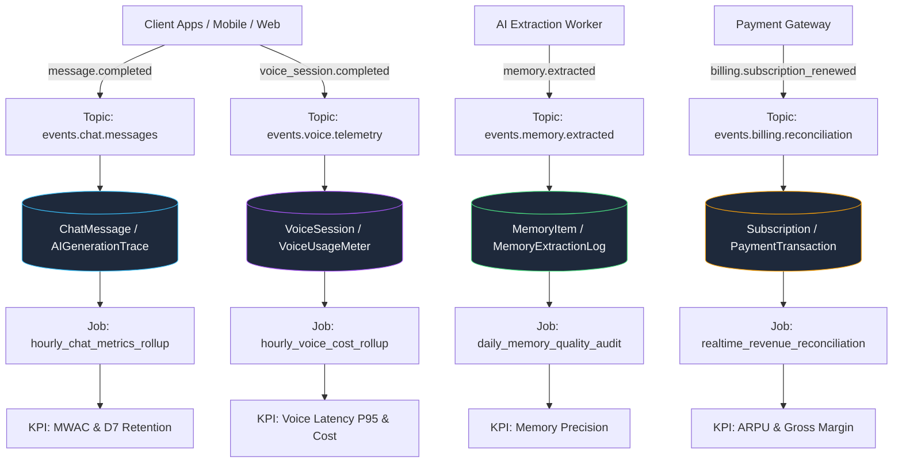

# Platform Data Lineage & Event Processing Graph

**Version:** 1.0.0  
**Status:** **OPERATIONAL**  

---

## 1. End-to-End Data Lineage Graph

---

## 2. Lineage Item Specifications

| Lineage ID | Event Name | Producer | Ingestion Topic | Primary DB Tables | Transformation Rollup | Aggregated KPIs | PII Sensitivity |
| :--- | :--- | :---: | :--- | :--- | :--- | :--- | :---: |
| `lineage_chat_msg` | `message.completed` | API_SERVER | `events.chat.messages` | `ChatMessage`, `AIGenerationTrace` | `hourly_chat_metrics_rollup` | MWAC, D7 Retention, AI-CP-DAU | `REDACTED` |
| `lineage_memory_extract` | `memory.extracted` | AI_WORKER | `events.memory.extracted` | `MemoryItem`, `MemoryExtractionLog` | `daily_memory_quality_audit` | Memory Precision, Conflict Rate | `PSEUDONYMIZED` |
| `lineage_voice_session` | `voice_session.completed`| GATEWAY | `events.voice.telemetry` | `VoiceSession`, `VoiceUsageMeter` | `hourly_voice_cost_rollup` | Voice Latency P95, Voice CP-DAU | `NONE` |
| `lineage_billing_webhook` | `billing.subscription_renewed`| API_SERVER | `events.billing.reconciliation`| `Subscription`, `PaymentTransaction` | `realtime_revenue_reconciliation` | ARPU, Gross Margin, MRR | `REDACTED` |
| `lineage_moderation_event`| `moderation.flagged` | API_SERVER | `events.safety.moderation` | `ModerationReport`, `SafetyIncident` | `realtime_safety_circuit_check` | Safety & Moderation Block Rate | `PSEUDONYMIZED` |

---

## 3. Retention & Deletion Propagation

When a user requests account deletion (`DELETE /api/v1/privacy/account`):
1. User record is soft-deleted and anonymized.
2. Vector embeddings and memory records are permanently deleted from database and vector index.
3. Personalization profile is completely purged from `PersonalizationEngine`.
4. Analytical event rollups retain aggregated counts without individual user identifiers.
