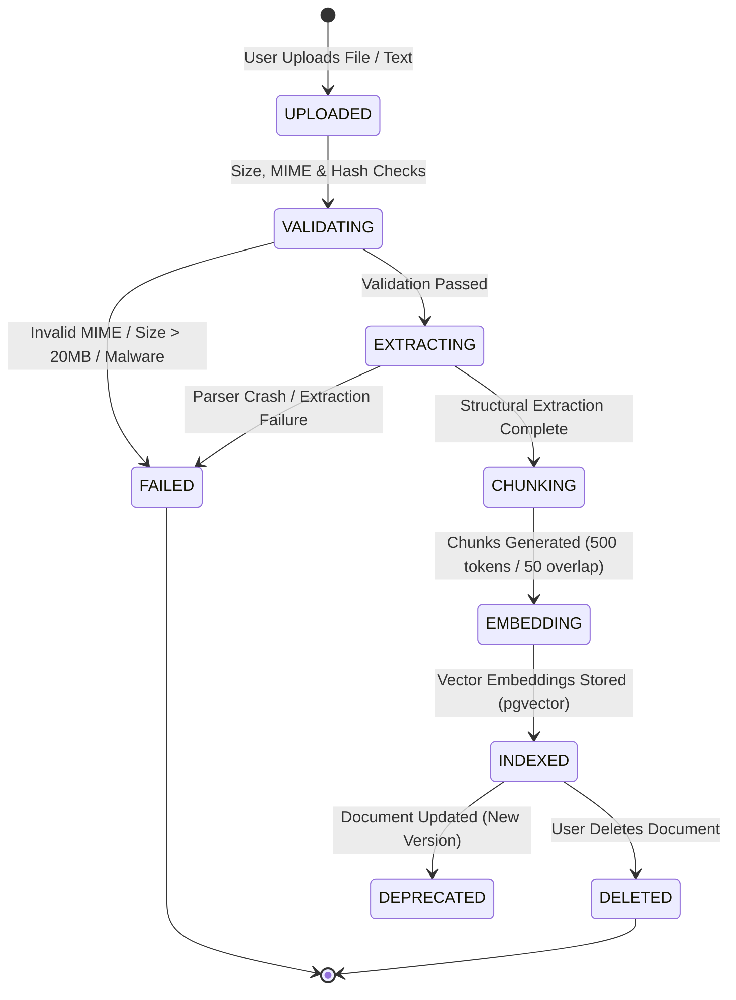

# Document Processing & Ingestion Pipeline (Phase 26)

## 1. Overview

The document ingestion pipeline safely transforms raw user and creator uploads into normalized, chunked, and vector-indexed knowledge representations. The entire pipeline operates under strict safety limits, preventing resource exhaustion (ReDoS, zip bombs, oversized payloads) and prompt injection vulnerabilities.

---

## 2. Ingestion Lifecycle & State Machine



### Document Status Values (`KnowledgeDocumentStatus`):
- `UPLOADED`: Initial upload received.
- `PROCESSING`: Validation, extraction, or embedding in flight.
- `INDEXED`: Chunks and embeddings stored and searchable in pgvector.
- `FAILED`: Safe error reason recorded; no orphan chunks stored.
- `DEPRECATED`: Superseded by a newer document version.
- `RESTRICTED`: Flagged by moderation or administrative hold.
- `DELETED`: Tombstoned and queued for storage purge.

---

## 3. Supported File Types & MIME Validation

The platform supports safe document formats:
- **Markdown / Text** (`text/markdown`, `text/plain`): Max 20MB.
- **Portable Document Format** (`application/pdf`): Max 20MB. Structural page and heading extraction.
- **Tabular Data** (`text/csv`, `application/json`): Preserves row/column hierarchy without flattening into unstructured noise.
- **Word Documents** (`application/vnd.openxmlformats-officedocument.wordprocessingml.document`): Section and paragraph preservation.

---

## 4. Security & Sanitization Guards

1. **Size Limit**: 20MB hard ceiling per document enforced before parsing.
2. **Duplicate Detection via SHA-256**:
   ```typescript
   const contentHash = crypto.createHash('sha256').update(content).digest('hex');
   const existing = await prisma.knowledgeDocument.findFirst({
     where: { ownerId, contentHash, status: { not: 'DELETED' } }
   });
   if (existing) return existing; // Deduplicate processing
   ```
3. **Malware & Script Sanitization**:
   - Rejection of embedded `<script>`, `<iframe>`, `javascript:`, or base64 executable payloads.
   - Text normalization to UTF-8 NFKC format to neutralize zero-width homoglyphs and hidden prompt injections.

---

## 5. Structural Extraction & Chunking Strategy

### A. Structure Preservation
Documents are segmented along semantic boundaries:
- Page numbers
- Headings (`#`, `##`, `###`)
- Section offsets
- Tables & bullet lists

### B. Configurable Chunking Parameters
- **Chunk Token Limit**: ~500 tokens (approx. 2000 characters).
- **Chunk Overlap**: 50 tokens (approx. 200 characters) to ensure context continuity across boundary cuts.
- **Boundary Priority**:
  1. Major heading breaks (`# Heading`)
  2. Double newline breaks (paragraphs)
  3. Single sentence boundaries (`. `)
  4. Character limit (hard fallback)

### C. Chunk Metadata Tracking
Every chunk record (`DocumentChunk`) preserves:
- `documentId`: Foreign key to parent document.
- `versionNumber`: Immutable version index.
- `chunkIndex`: Monotonically increasing chunk order.
- `pageNumber`: Physical or logical page number.
- `sectionHeading`: Current active section or subsection title.
- `sourceOffset`: Character offset from original document.
- `tokenCount`: Calculated token count.
- `contentHash`: SHA-256 hash of the individual chunk text for deduplication.

---

## 6. Embedding & Indexing

1. **AI Gateway Integration**:
   Embeddings are generated via `AIGatewayService.generateEmbeddings()` utilizing the platform's standardized embedding model (OpenAI `text-embedding-3-small`, 1536 dimensions).
2. **PostgreSQL pgvector Indexing**:
   Chunk vectors are stored in PostgreSQL using the `vector` extension.
   - Cosine distance (`<=>`) is utilized for high-accuracy similarity queries.
   - HNSW / IVFFlat indexing ensures sub-20ms lookup latency across 100,000+ chunks.
3. **Failure Isolation**:
   If an embedding API call fails or encounters provider rate limits, the document status is safely set to `FAILED` with an actionable `failureReason`. No empty or corrupted chunks remain in the active retrieval index.
