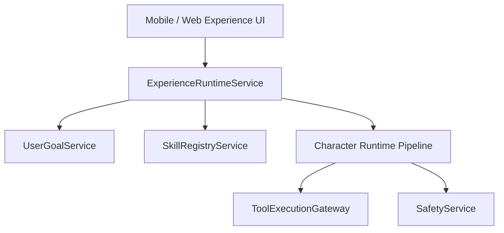

# GUIDED EXPERIENCE RUNTIME ARCHITECTURE

## 1. Overview
A **Guided Experience** is a multi-turn, structured interaction model that binds an AI character, a specific user goal, and one or more bounded skills into a cohesive session.

### Supported Experience Types
* **Study & Active Recall**: Socratic learning, flash quizzes, concept breakdowns, and progress tracking.
* **Mock Interview Prep**: Realistic technical and behavioral simulations with structured evaluation rubrics.
* **Travel Planning**: Constraint-based itinerary building with budget and location preferences.
* **Pair Programming**: Step-by-step code architecture decomposition, linting, debugging, and test generation.

---

## 2. Shared Runtime Architecture
Crucially, the experience runtime **does not** introduce a separate or parallel execution engine:

* **Goal Integration**: Starting an experience creates or links a `UserGoal` with explicit constraints.
* **Turn Bounds**: Every experience specifies `maxTurns` (typically 8–15 turns) to prevent unbounded loops.
* **Skill Binding**: The experience explicitly scopes which skills and tools the character is permitted to invoke.

---

## 3. Experience State & Lifecycle
The state of an ongoing experience is tracked durably in PostgreSQL:

| State | Description |
| :--- | :--- |
| `ACTIVE` | Currently progressing through multi-turn prompts and user replies. |
| `PAUSED` | Temporarily suspended due to user casual interruption or context switch. |
| `AWAITING_INPUT` | Waiting for the user to provide required parameters (e.g. travel dates). |
| `COMPLETED` | Objective fulfilled; session summary and progress stored. |
| `CANCELLED` | Explicitly terminated by the user. |

### Interruption & Resumption
If a user temporarily shifts topic ("Hold on, what's the weather today?"), the runtime detects the casual intent, pauses the experience goal without discarding state, answers the query, and gently offers to resume when ready.

---

## 4. Creator Experiences & Governance
Creators can configure experiences for their published characters:
1. **Schema Validation**: Verified against platform JSON schemas for permitted skills and duration.
2. **Automated Evaluation**: Must pass automated test runs evaluating prompt injection resistance and goal completion.
3. **Immutability**: Published experience versions cannot be mutated in place; updates require a new version.
4. **Analytics**: Telemetry tracks session starts, turn completion rates, drop-offs, and user satisfaction.
