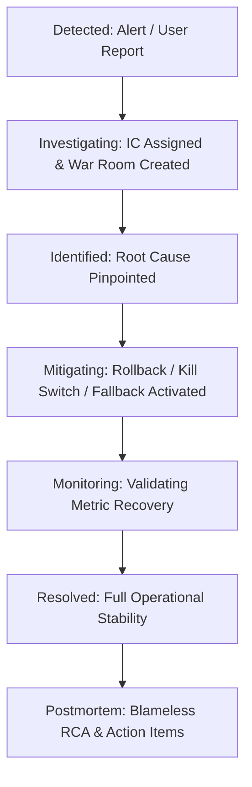

# Production Incident Management & Response Framework

## 1. Severity Classification & Response SLAs

| Severity | Definition & Impact Criteria | Response SLA | Target Mitigation | Update Cadence | Escalation Level |
| :--- | :--- | :--- | :--- | :--- | :--- |
| **SEV-0 (Catastrophic)** | Total platform outage, critical data loss/corruption, widespread payment failure, active security breach. | **$< 5\text{ minutes}$** | **$< 30\text{ minutes}$** | Every 15 minutes | Exec Staff + All Leads + Security Officer |
| **SEV-1 (Major Outage)** | Core feature down (Chat streaming, Voice calls, Authentication), provider outage with broken fallback, high crash rate ($> 2\%$). | **$< 15\text{ minutes}$** | **$< 1\text{ hour}$** | Every 30 minutes | Incident Commander + Domain Leads |
| **SEV-2 (Degradation)** | Secondary feature unavailable (Media generation, Discovery feed stale), AI response latency $> 3\text{s}$, queue depth backlog $> 1,000$. | **$< 30\text{ minutes}$** | **$< 4\text{ hours}$** | Every 60 minutes | On-Call Engineer + Service Owner |
| **SEV-3 (Minor / Bug)** | Non-blocking UI glitch, isolated single-user issue, minor telemetry delay. | **$< 4\text{ hours}$** | Next business day | On ticket change | Domain Engineer |

---

## 2. Incident Command Team & Roles

During a **SEV-0** or **SEV-1** incident, clear hierarchical command is enforced:

1. **Incident Commander (IC)**:
   - Owns the response process, directs investigations, approves mitigations and rollbacks.
   - Ensures no conflicting or rogue changes are deployed by independent engineers.
2. **Technical Lead (TL)**:
   - Directs root-cause diagnostics, analyzes logs/metrics, and proposes technical remediations.
3. **Communications Lead (CL)**:
   - Drafts internal executive summaries and manages public updates on the **Status Page** (`/status`).
4. **Scribe**:
   - Records chronological timeline events, decisions, configuration adjustments, and timestamps.

---

## 3. Incident Lifecycle & Workflow

### 3.1 Step-by-Step Response Protocol
1. **Detection & Triage**: Automated alert triggers in `#alerts-production` or P0 support ticket arrives. IC declares incident in Admin Command Center (`/api/v1/admin/operations/incidents`).
2. **War Room Activation**: IC creates Slack channel `#inc-[number]-[title]` and initiates huddle.
3. **Containment & Mitigation**:
   - Priority 1: Mitigate user impact immediately (e.g. trigger kill switch, switch AI fallback provider, roll back release) before deep root-cause debugging.
4. **Public Communication**: Update status page (`StatusPageService`) with clear, truthful, non-technical customer message (e.g. *"We are currently experiencing delays with voice responses. Text chat remains operational."*).
5. **Recovery Verification**: Monitor telemetry for 30 consecutive minutes of normal operational metrics.
6. **Resolution & Postmortem**: Mark incident resolved and schedule a blameless postmortem within 48 hours.

---

## 4. Communication Guidelines

- **Internal Updates**: State known facts only; avoid speculation. Format: `[Status] [Impact] [Current Action] [Next Update Time]`.
- **Customer Updates**: Never expose internal passwords, provider contract names, raw stack traces, or internal server IPs. Keep messages empathetic and actionable.
