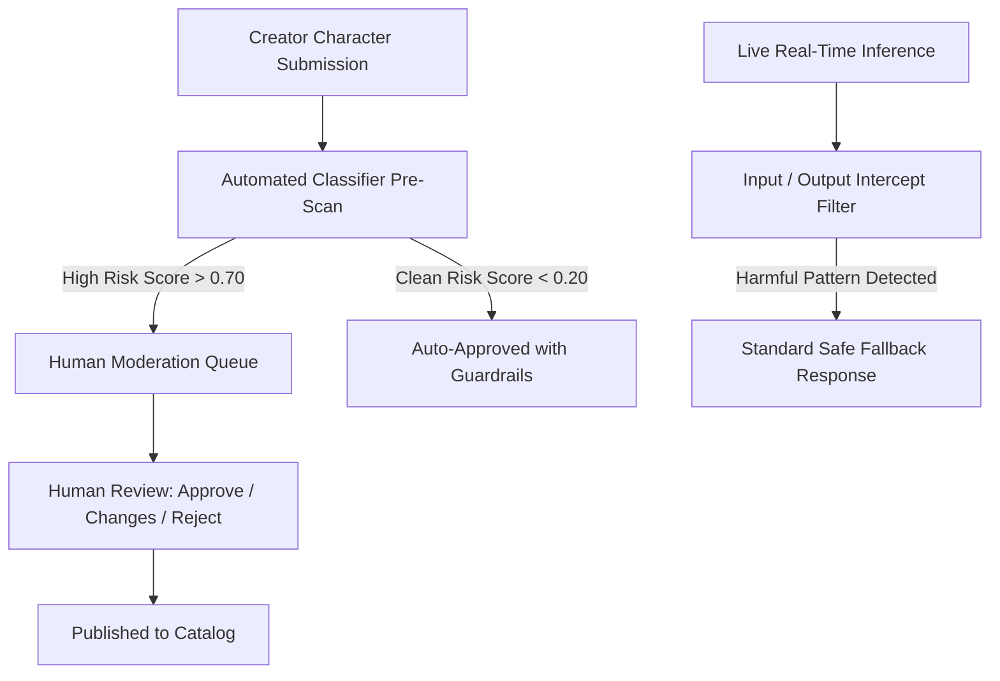

# Content Moderation & Trust & Safety Onboarding Guide

Welcome to the **AI Companion Trust & Safety Team**! This guide details character review policies, automated classifier systems, prohibited content enforcement, and appeal workflows.

---

## 1. Safety Architecture & Multi-Surface Classifiers

Our platform employs a multi-tiered safety system operating across **6 distinct surfaces**:

---

## 2. Prohibited Content Categories (Zero-Tolerance)

The following content is strictly prohibited from all characters, prompts, avatars, and voice generation:

1. **Child Sexual Abuse Material (CSAM) & Minor Harm**: Instant account ban and mandatory law enforcement escalation.
2. **Self-Harm & Suicide Encouragement**: Immediate intervention; system serves crisis lifeline resources.
3. **Non-Consensual Sexual Content & Deepfakes**: Strict ban on non-consensual depictions or impersonations of real living persons without verified legal authorization.
4. **Hate Speech, Harassment & Targeted Bullying**: Degrading speech targeted at protected characteristics.
5. **Terrorism, Violent Extremism & Weapon Fabrication Instructions**.

---

## 3. Character Review Queue & Decision Playbook

When reviewing a submitted character in the **Admin Moderation Workspace** (`/api/v1/admin/moderation`):

| Decision | When to Use | Resulting State | Creator Notification |
| :--- | :--- | :--- | :--- |
| **APPROVE** | Character meets all quality and safety guidelines, has complete personality data and safe avatar imagery. | `APPROVED` $\to$ Available for creator publishing. | *"Your character [Name] has been approved and is ready to publish!"* |
| **REQUEST CHANGES** | Character is promising but contains minor policy infractions (e.g. misleading tagline, border-case prompt phrasing). | `CHANGES_REQUESTED` | Specific actionable feedback provided in review notes. |
| **REJECT** | Character fundamentally violates safety policies (e.g. impersonation of a real celebrity, non-compliant imagery). | `REJECTED` | Reason code and policy explanation sent to creator. |
| **SUSPEND / UNPUBLISH** | Published character is generating harmful outputs or received verified community reports. | `SUSPENDED` | Character immediately removed from public discovery. |

---

## 4. Creator Appeals Workflow

1. Creators can submit **one appeal per rejected character version** explaining their remediation or disputing the classification.
2. Appeals must be reviewed by a **Senior Trust & Safety Specialist** who was not the original reviewer.
3. Decisions on appeals are rendered within **48 hours**.

---

## 5. Safety Emergency Escalation

For critical safety emergencies (e.g. imminent real-world harm, severe prompt injection jailbreaks):
- Immediately trigger the **Character Kill Switch** in Admin Command Center.
- Escalate directly to `#safety-emergencies` on Slack.
