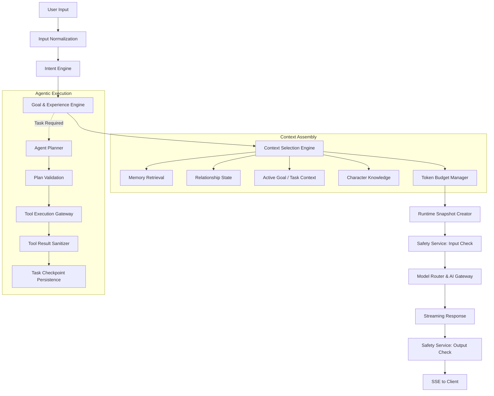

# Phase 25 — Advanced Character Intelligence, Agentic Experiences, Creator Ecosystem & Platform Extensibility
## Architecture & Technical Audit

---

### Executive Overview

Phase 25 deepens the platform's intelligence and extensibility layer across:
1. **Character Intelligence Runtime**: Structured intent classification, goal management, multi-turn goals, and deterministic character runtime snapshots.
2. **Agentic Capabilities & Skills**: Bounded, versioned skills, plan generation with validation, task checkpoints, user cancellations, and high-risk confirmations with expiration and HMAC binding.
3. **Context Selection Engine**: Relevance- and recency-ranked candidate assembly, dynamic token budgeting, context attribution, and memory conflict resolution.
4. **Creator Extensions & Experience Runtime**: Guided experiences (study, interview, travel, coding), creator-defined declarative skills, sandboxed knowledge ingestion with chunking/moderation/rollback.
5. **Security, Governance & Persistence**: Eliminating in-memory Maps in favor of durable PostgreSQL models and Prisma migrations, strict tenant isolation, secret masking, prompt injection defense, and permanent hard-disabling of unverified payment tools (`PAYMENT_TOOL_DISABLED`).

---

### 1. Current Architecture Review

| Subsystem | Existing Implementation | File Paths | Assessment |
| :--- | :--- | :--- | :--- |
| **Character Engine** | Immutable character runtime builder and compiler using 12-tier prompt hierarchy. | `apps/api/src/modules/characters/engine/runtime.ts` `apps/api/src/modules/characters/engine/compiler.ts` `apps/api/src/modules/characters/services/character.service.ts` | **Solid**. Separates identity, communication, behavior, and safety rules. Needs generation runtime snapshot for audit and reproducibility. |
| **Context Builder** | Sequential prompt builder injecting memory, relationship state, summary, and user context within token limits. | `apps/api/src/modules/conversations/engine/contextBuilder.ts` `apps/api/src/modules/ai/context/ContextBudgetManager.ts` | **Operational**. Currently static assembly; lacks candidate ranking, task/goal context injection, and attribution tracking. |
| **Memory Engine** | Semantic retrieval using pgvector embeddings, deduplication, conversation summaries, access logging, and user controls. | `apps/api/src/modules/memory/services/*` | **Mature**. Ready for conflict resolution and temporary context expiration. |
| **Relationship Engine** | Stage-based affective tracking (stranger -> acquaintance -> friend -> trusted -> soulmate), dynamic sentiment analysis, decay, and policies. | `apps/api/src/modules/relationships/services/*` | **Production-Ready**. Isolates relationship state from generic agent memory. |
| **AI Gateway & Routing** | Multi-provider abstraction (OpenAI, Anthropic, Mock), model registry, circuit breakers, and streaming adapter. | `apps/api/src/modules/ai/gateway/*` `apps/api/src/modules/ai/routing/*` | **Extensible**. Supports provider fallback, model capability matrix, and token telemetry. |
| **Agent Runtime & Tools** | Planner, task state machine, tool registry, execution gateway, high-risk confirmation service, OAuth vault, browser tool. | `apps/api/src/modules/agents/*` | **Partially In-Memory**. Uses in-memory `Map` stores for tasks, plans, consents, confirmations, and OAuth connections. Must be migrated to Prisma database models. |
| **Safety & Moderation** | Input/output classifiers, user restrictions, policy engine, prompt injection filters, and emergency kill switches. | `apps/api/src/modules/safety/services/*` | **Hardened**. Universal gatekeeper for all actions, tools, and social interactions. |
| **Social Layer** | Phase 24 durable social action gateway, 23 PostgreSQL tables, outbox events, rate limiters, PII redaction, and audit logs. | `apps/api/src/modules/social/*` | **Hardened**. AI characters propose social actions; they can never autonomously execute them. |
| **Billing & Economics** | Plan entitlements, usage meters, usage reservations, credit wallets, and transactions. | `apps/api/src/modules/billing/services/*` | **Production-Ready**. Ready for agent task cost reservations and refunds. |

---

### 2. Reusable Components

The following existing services will be directly leveraged without duplication:
1. **`ToolExecutionGateway`**: Already implements capability checks, consent enforcement, confirmation token validation, and tool output sanitization (`ToolResultSanitizer`).
2. **`toolSafety.ts`**: Contains `HARD_DISABLED_TOOLS` (specifically `payment.create` with code `PAYMENT_TOOL_DISABLED`) ensuring no fake payments can execute.
3. **`SafetyService` & `PolicyEngine`**: Evaluates inputs, outputs, and action proposals against content boundaries and abuse rules.
4. **`ObjectStorageService`**: Provides S3-compatible multi-part uploads and pre-signed URLs for media and document assets.
5. **`EntitlementService` & `UsageReservationService`**: Handles pre-execution cost estimation, credit reservations, and commit/release mechanics.
6. **`QueueManager` & BullMQ**: Centralized job queue processing for background tasks, retries, and dead-letter queues.
7. **`AIGateway` & `ModelRouter`**: Unified LLM provider streaming and token usage tracking.

---

### 3. Missing Capabilities (Phase 25 Mandate)

1. **Intent Engine (`IntentEngine.ts`)**:
   - Structured intent classification (casual conversation, question, advice, planning, task request, information lookup, creative, emotional support, media understanding, external action, reminder, long-running task).
   - Confidence scoring and source attribution.
   - Low-confidence fallback: continues normal conversation without triggering tools or external side effects.
2. **User Goal Engine (`UserGoalService.ts`)**:
   - Explicit user goal representation (e.g. `travel_planning`, `interview_preparation`, `code_review`).
   - Full lifecycle states: `created`, `active`, `paused`, `blocked`, `awaiting_input`, `awaiting_confirmation`, `executing`, `completed`, `cancelled`, `expired`, `failed`.
   - Multi-turn resumption and goal conflict/interruption resolution without replaying entire conversation transcripts.
3. **Skill System & Versioning (`SkillRegistryService.ts`)**:
   - Bounded capabilities (research, summarization, planning, writing, coding, doc analysis, calendar planning, travel planning).
   - Immutable versioning: `draft`, `testing`, `published`, `deprecated`, `disabled`.
   - Character-skill assignment matrix (default, optional, premium, creator, disabled).
4. **Experience Runtime (`ExperienceRuntimeService.ts`)**:
   - Structured session experiences (study session, interview practice, travel planning, coding workshop, language tutor).
   - Manages state, progress tracking, guided prompts, tool boundaries, and user feedback.
5. **Character Runtime Snapshot (`CharacterRuntimeSnapshotService.ts`)**:
   - Immutable generation snapshot linking character version, prompt version, behavior policy, safety policy, model, memory IDs, relationship stage, and capability state.
   - Ensures full post-generation explainability and auditability.
6. **Context Selection Engine (`ContextSelectionEngine.ts`)**:
   - Multi-source candidate gathering (conversation, summary, memory, relationship, user preferences, goal, task, character knowledge, tool results, multimodal attachments).
   - Relevance-, recency-, and importance-weighted scoring within token budget.
   - Attribution logging and memory correction loop.
7. **Creator Extensions & Knowledge Ingestion**:
   - Sandboxed declarative skills for creators.
   - Knowledge ingestion pipeline: upload -> validation -> virus/malware scan -> text extraction -> chunking -> vector embedding -> moderation -> versioned indexing.
   - Version rollback support.
8. **Durable Database Persistence**:
   - Replace in-memory Maps in `AgentTaskService`, `SkillRegistryService`, `HighRiskConfirmationService`, `OAuthVaultService`, and `MultimodalContextService` with relational Prisma tables.

---

### 4. Duplicated Systems & Technical Debt Identified

1. **In-Memory Agent Persistence**:
   - `AgentTaskService.tasks`, `AgentTaskService.plans` were in-memory `Map` collections.
   - `HighRiskConfirmationService.tokenStore` was an in-memory `Map`.
   - `OAuthVaultService.vault` was an in-memory `Map`.
   - `SkillRegistryService.skills` was an in-memory `Map`.
   - *Resolution*: Define normalized Prisma models (`AgentTaskRecord`, `AgentPlanRecord`, `AgentTaskCheckpoint`, `UserGoalRecord`, `SkillRecord`, `SkillVersionRecord`, `CharacterSkillRecord`, `CharacterExperienceRecord`, `GenerationSnapshotRecord`, `OAuthConnectionRecord`) and apply via Prisma migrations.
2. **Decoupled Generation Flow**:
   - `streamingChat.service.ts` directly invoked the LLM without evaluating structured user intents or active user goals.
   - *Resolution*: Wire `IntentEngine` and `UserGoalService` into context assembly so active tasks and goals inform responses transparently.

---

### 5. Unsafe Assumptions & Risk Analysis

1. **Payment Tool Bypass Risk**:
   - Ensure `payment.create` remains hard-disabled in `HARD_DISABLED_TOOLS` with code `PAYMENT_TOOL_DISABLED`. No agent, creator, or scheduled task can invoke or simulate payments.
2. **Prompt Injection via Tool Outputs**:
   - Web pages, documents, and API responses are untrusted external data.
   - `ToolResultSanitizer` must sanitize all outputs and wrap them in clear data demarcations (`[DATA_ONLY_DO_NOT_EXECUTE]`).
3. **Unbounded Agent Loops**:
   - Tasks must strictly enforce bounds (`maxSteps`, `maxDurationMs`, `maxCostUsd`, `maxTokens`, `maxToolCalls`, `maxRetries`).
4. **Approval Expiration**:
   - High-risk confirmation tokens must have a strict TTL (15 minutes), bind to the exact argument hash, and be single-use.
5. **Cross-Tenant Context Contamination**:
   - Character knowledge must remain strictly separated from individual user memories. A user's personal memories must never bleed into character knowledge or other users' sessions.

---

### 6. Integration Points

---

### 7. Action Plan

1. **Phase 25 Database Schema**: Add normalized models to `apps/api/prisma/schema.prisma` for Tasks, Plans, Checkpoints, Goals, Skills, Experiences, Snapshots, and OAuth Connections.
2. **Deploy Migration**: Create migration `20260924020000_phase25_intelligence_runtime` and apply via `pnpm db:migrate:deploy`.
3. **Core Intelligence Modules**:
   - Implement `IntentEngine.ts` and `UserGoalService.ts`.
   - Implement `ContextSelectionEngine.ts` and `CharacterRuntimeSnapshotService.ts`.
   - Implement `SkillRegistryService.ts` and `ExperienceRuntimeService.ts` backed by Prisma.
   - Enhance `AgentTaskService.ts` and `AgentPlanner.ts` with checkpointing and durable database storage.
   - Implement `KnowledgeIngestionService.ts` with versioning, scanning, chunking, and moderation.
4. **Chat Streaming Integration**: Update `streamingChat.service.ts` to seamlessly leverage intent detection, active goals, and runtime snapshots.
5. **Admin AI Studio & Simulator**: Update `apps/admin` with tabs for Model Routing, Skills, Experiences, Tool Policies, Task Traces, and the Agent Simulator.
6. **Mobile Integration**: Add Task & Experience screens/components in `apps/mobile`.
7. **Verification & Tests**: Author unit, security, integration, and load tests. Ensure monorepo lint and typecheck pass with zero errors.
