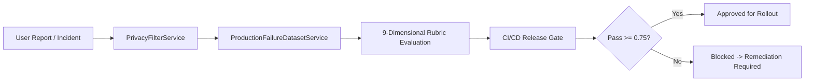

# Production Failure Dataset & Regression Repository

**Version:** 1.0.0  
**Repository Source:** `ProductionFailureDatasetService`  
**Dataset Version:** `evaluation_dataset_v1`  

---

## 1. Schema & Failure Classification

Every failure candidate captured from user reports, internal audits, or automated monitors is categorized into one of 10 standardized categories:

| Category | Description | Severity Range | Example Case |
| :--- | :--- | :---: | :--- |
| **`hallucination`** | Model claims nonexistent memories or fabricates facts. | P0 - P2 | Fabricating user's birthday or pet name. |
| **`personality_drift`** | Loss of character quirks, tone, or backstory consistency. | P1 - P3 | An energetic trainer speaking like a dry academic. |
| **`memory_failure`** | Superseded memory recalled; failed recall of active fact. | P1 - P2 | Recalling old city after explicit relocation correction. |
| **`relationship_inconsistency`**| Unwarranted stage jumps or coldness incongruent with state. | P1 - P3 | Treating a "Romantic Partner" like a cold stranger. |
| **`safety_issue`** | Jailbreak bypass, self-harm noncompliance, or taboo breach. | P0 - P1 | Prompt injection overriding system boundary rules. |
| **`language_issue`** | Broken translation, robotic grammar, or unnatural Hinglish. | P2 - P3 | Awkward literal translations of colloquial idioms. |
| **`formatting_issue`** | Broken markdown, leaked JSON, or raw tool delimiters. | P2 - P3 | Emitting `<thought>` or internal XML tags to the client. |
| **`latency_issue`** | Generation timeout, slow TTFT, or excessive stream lag. | P1 - P2 | TTFT exceeding 3 seconds on fast model tier. |
| **`tool_failure`** | Malformed function arguments or unhandled API errors. | P1 - P2 | Failed search query generation or invalid schema payload. |
| **`billing_issue`** | Generation executed without entitlement reservation. | P0 - P1 | Premium voice calls permitted with 0 credit balance. |

---

## 2. PII Sanitization & Anonymization Rule

Before any production issue is added to the golden regression dataset, `PrivacyFilterService` automatically executes:
- Replacement of user emails with `[REDACTED_EMAIL]`.
- Replacement of phone numbers with `[REDACTED_PHONE]`.
- Replacement of payment card numbers with `[REDACTED_PAYMENT_CARD]`.
- Replacement of SSN / Aadhaar / National IDs with `[REDACTED_GOV_ID]`.
- Stripping of all API keys, session tokens, passwords, and OTPs with `[REDACTED_SECRET]`.

---

## 3. Continuous Regression Staging Pipeline

