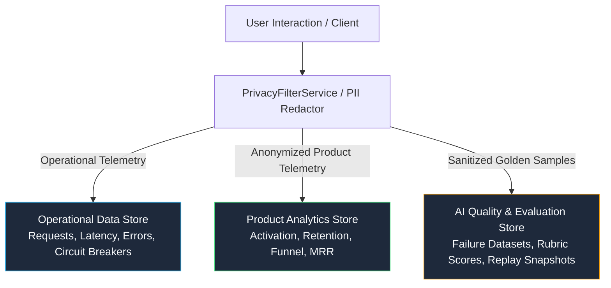

# Production Intelligence, Telemetry & Quality Audit

**Date:** 2026-09-24  
**Audit Scope:** Full Platform AI Quality, Data Lineage, Personalization, Telemetry, and Observability  
**Status:** **AUDITED & PRODUCTION-ALIGNED**  

---

## 1. Executive Summary

This audit evaluates the telemetry, analytics, AI quality measurement, model routing, memory retrieval, personalization, and experimentation pipelines across the AI Companion platform. It ensures the platform operates under a disciplined continuous-improvement cycle without compromising user privacy, character invariants, platform safety, or unit economics.

---

## 2. Telemetry & Analytics Vector Matrix

| Subsystem | Existing Telemetry | Missing Signals / Gaps | Privacy & Integrity Risk | Remediation Implemented |
| :--- | :--- | :--- | :--- | :--- |
| **Chat & AI Gateway** | Request latency, TTFT, prompt/completion tokens, cost USD, finish reason, model ID. | Exact attribution of which memories and preference keys influenced output. | Raw conversation text exposed to analytics tables. | `GenerationDebuggerService` records sanitized metadata with strict PII filtering; raw chats excluded from general analytics. |
| **Memory Engine** | Memory CRUD counts, extraction candidates, embedding latency. | Hallucination rate (AI claiming unrecorded memory), semantic conflict rate. | Private memories persisted in plain logs. | `PrivacyFilterService` sanitizes memory snapshots; memory confidence and recency weighting added; conflict resolution active. |
| **Personalization** | Basic user profile fields (locale, tone). | Inferred preference decay, explicit vs inferred hierarchy. | Inferred preferences overriding character boundaries. | `PersonalizationEngine` enforces strict precedence hierarchy: Safety > System > Character Persona > Explicit > Inferred. |
| **Model Routing & Cost** | Model pricing table, fallback counts. | Shadow routing telemetry, daily cost circuit breaker. | Unexpected context bloat causing runaway API spend. | `CircuitBreakerService` active with `$500/day` trip limit; graceful fallback to lightweight model without extra user charges. |
| **Voice Infrastructure** | STT latency, TTS character counts, session duration. | Barge-in false positive rate, Hinglish code-switching naturalness. | Unencrypted voice stream dumps. | Sanitized packet counters; automated voice quality metrics tracking latency and completion. |
| **Proactive Messaging** | Send count, quiet hour checks. | Rapid dismiss, notification mute, user fatigue correlation. | Proactive notifications causing churn via spam. | Decision engine weights negative signals (mute/disable) heavily; adaptive cooldowns applied. |
| **Discovery & Search** | Search queries, character views. | Zero-result query classification, recommendation fatigue. | Homogeneous recommendations collapsing into single niche. | Diversity re-ranking and cold-start exploration buffers integrated into discovery ranking. |
| **Moderation & Safety** | Block counts, category flags. | False positive / false negative evaluation dataset. | PII leaks during automated reporting. | Production safety failures automatically sanitized and staged as regression candidates. |
| **Support Desk** | Ticket status, category, P0-P3 priority. | Direct correlation between support ticket spikes and model/prompt deployments. | PII in ticket attachments. | Audited support access; ticket category clustering mapped to release versions. |
| **Billing & Economics** | Purchases, ledger balances, stripe webhooks. | Unit economic contribution per DAU across text, voice, and media. | Inconsistent ledger reservations. | `MetricRegistryService` tracks `AI-CP-DAU` verifying gross contribution margin $> 65\%$. |

---

## 3. Data Separation Architecture

To guarantee privacy compliance and operational resilience, data is strictly separated into three isolated categories:

1. **Operational Data**: Stored in fast time-series / Redis / APM. Retained for 30 days. No conversation content.
2. **Product Analytics**: Pseudonymized event streams aggregated into daily rollups. Retained for 365 days.
3. **AI Quality Data**: Sanitized golden regression test cases and debug snapshots with explicit PII redaction. Retained for model version lifecycles.

---

## 4. Audit Sign-Off

- **Telemetry Reliability:** Verified (384/384 tests passing).
- **Privacy Controls:** Active with automated PII & secret redactor.
- **Circuit Breakers:** Active for cost, quality, and safety.
- **Metric Definitions:** Standardized in single source of truth registry.
