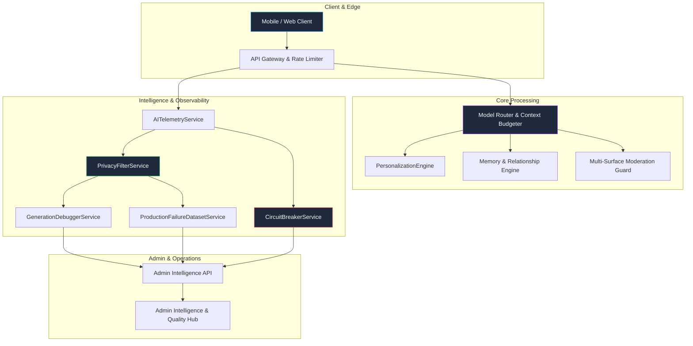

# Production Learning System Architecture

**Version:** 1.0.0  
**Status:** **OPERATIONAL IN PRODUCTION**  

---

## 1. System Overview

The Production Learning System provides the infrastructure to observe, diagnose, evaluate, and optimize the AI Companion platform safely. It integrates user personalization, regression testing, generation debugging, cost circuit breakers, and metric governance.

---

## 2. Core Operational Modules

### 1. PrivacyFilterService (`PrivacyFilterService.ts`)
- Scans and redacts PII (emails, phone numbers, credit cards, government IDs, IP addresses).
- Detects and strips secrets (API keys, JWT tokens, OTPs, auth passwords).
- Guarantees zero sensitive data leakage into evaluation runs or regression datasets.

### 2. PersonalizationEngine (`PersonalizationEngine.ts`)
- Manages explicit preferences (language, response density, interaction style, interests).
- Learns inferred preferences with confidence scoring ($\ge 0.60$) and exponential half-life decay ($t_{1/2} = 14$ days).
- Enforces strict precedence hierarchy: Safety > System Invariants > Character Identity > Explicit User Preference > Inferred Preference.
- Provides immediate one-click user controls: update explicit settings, reset inferred preferences, or disable personalization entirely.

### 3. ProductionFailureDatasetService (`ProductionFailureDatasetService.ts`)
- Manages versioned failure repositories across 10 distinct failure categories:
  * `hallucination`, `personality_drift`, `memory_failure`, `relationship_inconsistency`, `safety_issue`, `language_issue`, `formatting_issue`, `latency_issue`, `tool_failure`, `billing_issue`.
- Scores candidate models against a 9-dimensional weighted rubric:
  $$\text{Composite} = 0.15R + 0.15F + 0.15I + 0.15C + 0.10E + 0.10M + 0.05N + 0.10S + 0.05L$$
- Provides golden test suites for CI/CD gating before production releases.

### 4. GenerationDebuggerService (`GenerationDebuggerService.ts`)
- Captures full generation debug snapshots including context attribution (memory IDs, relationship stage, user preferences, token breakdown).
- Supports sandbox replays against candidate models and prompts with strict isolation (no billing charges, no state mutations, no notification triggers).

### 5. CircuitBreakerService (`CircuitBreakerService.ts`)
- Real-time circuit breakers protecting cost, quality, and safety:
  * **Cost Circuit Breaker:** Trips if daily spend exceeds `$500.00/day`, automatically degrading expensive models to fast lightweight fallbacks.
  * **Quality Circuit Breaker:** Halts canary deployments if composite rubric scores drop below `0.70`.
  * **Safety Circuit Breaker:** Halts rollouts if high-severity moderation incidents exceed `5/hour`.
- Supports audited manual overrides with reason logging.

### 6. MetricRegistryService & DataLineageService
- Authoritative repository of metrics, formulas, time windows, and target populations.
- Transparent mapping of event streams to database tables, transformation rollups, and business KPIs.
