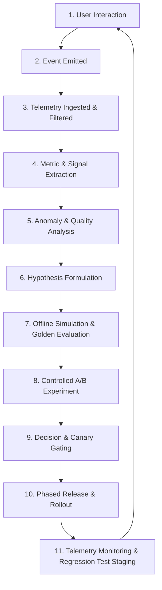

# Continuous Product Learning Loop & Evaluation Framework

**Purpose:** Defines the standardized engineering cycle for transforming live production telemetry into measured, hypothesis-driven improvements without speculative redesigns or unvetted model changes.

---

## 1. The 11-Stage Production Learning Loop

The platform operates on a closed-loop continuous optimization cycle:

---

## 2. Stage Breakdown & Execution Rules

### Stage 1: User Interaction
Real users interact across chat streaming, voice calls, proactive messages, media generation, or creator studio tools.

### Stage 2: Event Emitted
Events are emitted via standardized event schemas with unique `requestId`, `correlationId`, and `timestamp`.

### Stage 3: Telemetry Ingested & Filtered
`PrivacyFilterService` redacts all PII (emails, phone numbers, addresses, payment cards, SSN/Aadhaar) and secrets before storage.

### Stage 4: Metric & Signal Extraction
Events are aggregated against authoritative definitions in the `MetricRegistryService` (e.g. MWAC, D7 Retention, Memory Precision, AI-CP-DAU).

### Stage 5: Anomaly & Quality Analysis
Root cause analysis groups anomalies by dimension: release version, model, provider, character category, and client platform.

### Stage 6: Hypothesis Formulation
Engineers write structured hypotheses:
> *"Reducing context prompt bloat by 25% through summarized episodic memories will lower P95 latency by 80ms while maintaining rubric character consistency above 0.88."*

### Stage 7: Offline Simulation & Golden Evaluation
The candidate prompt or model is run against the `ProductionFailureDatasetService` regression suite. Pass criterion: composite rubric score $\ge 0.75$ and zero safety regressions.

### Stage 8: Controlled A/B Experiment
The experiment is deployed using deterministic user hashing with strict guardrails (crash rate, billing errors, safety flags).

### Stage 9: Decision & Canary Gating
Automated evaluation checks if treatment improves the primary metric without violating guardrails. Canary release gates: $1\% \to 5\% \to 10\% \to 25\% \to 50\% \to 100\%$.

### Stage 10: Phased Release & Rollout
Deployment is tagged with unique release identifiers. Circuit breakers remain primed to halt rollout if quality or cost thresholds trip.

### Stage 11: Telemetry Monitoring & Regression Test Staging
Identified edge cases and verified user failure reports are sanitized and permanently staged into the golden failure dataset for future builds.

---

## 3. Strict Prohibitions (No Uncontrolled Self-Learning)

1. **NO Autonomous Code / Prompt Mutation:** The platform does NOT autonomously rewrite system prompts, modify safety policies, alter billing formulas, or switch primary production models without human engineering review and approval.
2. **NO Speculative Feature Bloat:** Features are only introduced or iterated when validated by metric signals and hypotheses.
3. **NO Metric Gaming:** Never optimize raw open rates, message frequency, or token counts at the expense of user trust, safety, and long-term retention.
