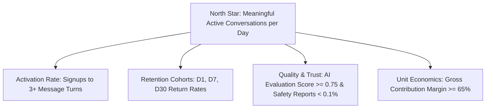

# Product Operations & Growth Framework

## 1. Product Metric Hierarchy



---

## 2. Feature Flags & Kill Switch Governance

1. **Flag Hygiene**:
   - Every feature flag must have a designated Owner, Business Purpose, and Expiration Date (maximum 90 days).
   - Once a feature reaches 100% General Availability, the flag must be deprecated and removed from the codebase within two sprint cycles.
2. **Operational Kill Switches**:
   - High-cost or high-risk features (`image_generation`, `voice_calls`, `proactive_messaging`, `creator_publishing`) have sub-millisecond in-memory kill switches accessible in Admin Command Center.

---

## 3. Experimentation & A/B Testing Protocol

### 3.1 Experiment Setup Rules
- **Hypothesis**: Clear, falsifiable hypothesis (e.g. *"Adding a voice sample preview to character detail increases conversation starts by 8%"*).
- **Primary Metric**: Exactly ONE primary metric.
- **Guardrail Metrics**: Latency P95 ($< 500\text{ms}$), Unsubscribe Rate, AI Error Rate, Safety Violations.
- **Sample Ratio Mismatch (SRM) Monitoring**: If allocation diverges from target 50/50 split by $> 2\%$ ($p < 0.01$), the experiment is automatically paused.

### 3.2 Experimentation Lifecycle
```
DRAFT ──> RUNNING (Staged 10% -> 50%) ──> SIGNIFICANCE ACHIEVED ──> 100% ROLLOUT or ROLLBACK ──> ARCHIVED
```

---

## 4. Character Discovery & Ranking Configuration

The discovery engine ranks characters using weighted multi-factor scoring with **Maximal Marginal Relevance (MMR)** diversity:

| Parameter | Default Weight | Operational Purpose |
| :--- | :--- | :--- |
| `semanticRelevance` | 0.30 | Matches user intent and query embeddings. |
| `categoryMatch` | 0.20 | Aligns with user's preferred companion archetypes. |
| `qualityScore` | 0.15 | Favor characters with high retention and positive ratings. |
| `trendingVelocity` | 0.15 | Highlights rapidly rising community companions. |
| `freshness / Novelty` | 0.10 | Explores new approved creator characters. |
| `fatiguePenalty` | -0.10 | Downranks characters the user has repeatedly dismissed. |
| **MMR Diversity ($\lambda$)** | **0.75** | Prevents top of feed from being dominated by a single creator or category. |

---

## 5. Proactive Outreach Engine Governance

- **Default Quiet Hours**: `22:30` to `08:00` in user's local timezone.
- **Frequency Caps**: Maximum 3 proactive notifications per day; maximum 14 per week.
- **Disengagement Backoff**: If a user ignores 2 consecutive proactive outreach messages, system enters a **72-hour cooldown**.
- **User Opt-Out**: Users can disable proactivity globally or per-character in Settings.
