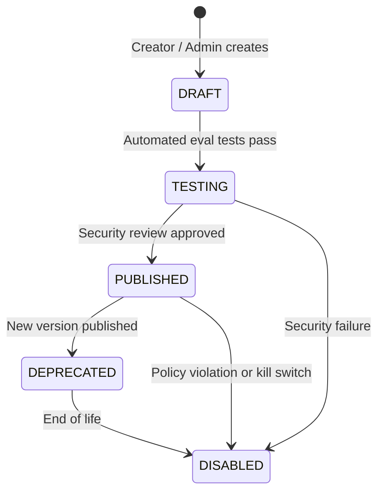

# CHARACTER SKILL SYSTEM ARCHITECTURE

## 1. Concept: Skills vs. Personality
A **Skill** represents a bounded, auditable capability that enables a character to accomplish a structured objective (e.g. `travel_planning`, `coding_mentor`, `study_assistant`).

* **Skills are NOT Personality Traits**: Personality dictates tone, empathy, humor, and style. Skills dictate task decomposition, allowed tools, validation rubrics, and step budgets.
* **Separation of Concerns**: A character may adopt an empathetic, sarcastic, or scholarly persona, but their skill execution strictly obeys deterministic bounds and permissions.

---

## 2. Skill Registry & Versioning
All skills are persisted in PostgreSQL across normalized tables:
* `SkillRecord`: Top-level identity, ownership (`isSystem` vs creator), category, default bounds, and active version pointer.
* `SkillVersionRecord`: Immutable snapshot of the prompt template, schema, required tools, and policy constraints.
* `CharacterSkill`: Join table defining character assignments (status, pricing tier, override limits).

### Skill Version Lifecycle


Published versions are **immutable**. Once published, changes require issuing a new version (`v1.1`, `v2.0`).

---

## 3. Creator Skill Sandbox
To allow creators to build tailored capabilities safely without platform risk:

1. **Declarative Only**: Creator skills are defined purely through declarative schemas, structured prompts, and references to platform-approved tools.
2. **Zero Code Execution**: Creators cannot execute arbitrary server-side JavaScript/Python or raw SQL.
3. **Tenant & Data Isolation**: Skills cannot query arbitrary databases, access other users' memories, or view internal platform credentials.
4. **Hard Sandbox Limits**:
   * Maximum Steps: `10`
   * Maximum Cost: `$0.50 USD`
   * Timeout: `30,000 ms`
5. **No Direct HTTP**: External web requests can only occur via the monitored, rate-limited `ToolExecutionGateway`.

---

## 4. Character-Skill Assignment & Discovery
Characters possess assigned skills configured via `CharacterSkill`:
* `default`: Always available to the character.
* `optional`: Activated only when relevant intent is detected.
* `premium`: Requires user subscription entitlement or credit balance.
* `disabled`: Explicitly turned off for safety or creator preference.

### Runtime Skill Resolution
```
User Message → IntentEngine (confidence ≥ 0.65)
             → SkillRegistryService.resolveSkillForCharacter(characterId, intent)
             → CharacterSkill Check (enabled & entitled)
             → SafetyService Validation
             → Sandboxed Plan Generation
```
The model can **never** arbitrarily enable tools or escalate privileges outside of this resolved assignment.
