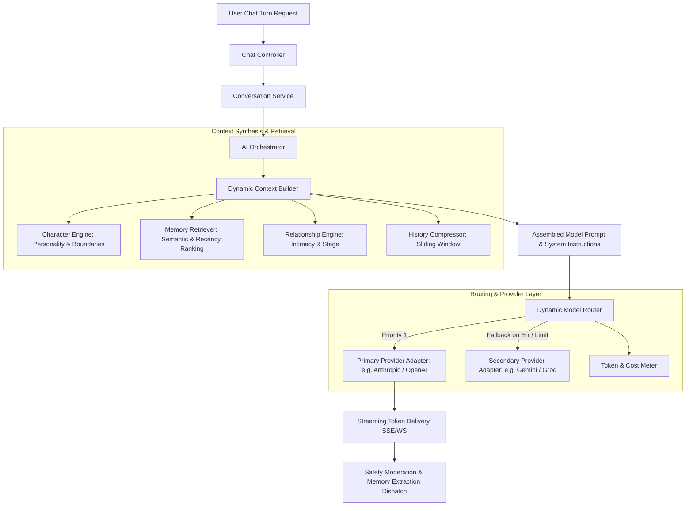

# AI System & Orchestration Architecture

## 1. Gateway & Decoupling Architecture

Controllers and business domain services NEVER call external AI APIs (OpenAI, Anthropic, Google, etc.) directly. All AI interactions flow through the **AI Orchestration Pipeline**.



---

## 2. Model Routing Strategy

The platform maintains a centralized, database-configurable Model Routing Registry. Requests are routed dynamically based on task classification:

| Task Type               | Target Characteristics                        | Default Model Tier                | Fallback Model Tier               | Max Latency Budget    |
| :---------------------- | :-------------------------------------------- | :-------------------------------- | :-------------------------------- | :-------------------- |
| **Realtime Chat**       | Low TTFT (Time To First Token), rich roleplay | Claude 3.5 Sonnet / GPT-4o-mini   | Gemini 1.5 Flash / Groq Llama-3.3 | < 800ms TTFT          |
| **Memory Extraction**   | High structured output fidelity, low cost     | GPT-4o-mini / Gemini 1.5 Flash    | Claude 3 Haiku                    | Async (no user block) |
| **Summarization**       | Long-context comprehension                    | Gemini 1.5 Flash / Claude 3 Haiku | GPT-4o-mini                       | Async (no user block) |
| **Vector Embedding**    | Consistent cosine geometry                    | text-embedding-3-small (1536d)    | text-embedding-3-large            | < 250ms               |
| **Safety / Moderation** | Zero-shot toxicity/PII filter                 | Llama-Guard / OpenAI Moderation   | Keyword & Rule Filter             | < 200ms               |

---

## 3. Streaming Protocol Specification

Chat streaming uses **Server-Sent Events (SSE)** with a typed chunk protocol:

```typescript
// SSE Event Stream Types
type SSEMessageEvent =
  | { type: 'chunk'; payload: { delta: string; messageId: string } }
  | { type: 'thought'; payload: { delta: string } }
  | { type: 'status'; payload: { state: 'retrieving_memory' | 'synthesizing' | 'generating' } }
  | {
      type: 'relationship_delta';
      payload: { trustChange: number; intimacyChange: number; event: string };
    }
  | { type: 'complete'; payload: { messageId: string; totalTokens: number; durationMs: number } }
  | { type: 'error'; payload: { code: string; message: string; retryable: boolean } };
```

### Idempotency & Reconnection

- Each turn request accepts an `idempotencyKey` (UUIDv7).
- If connection drops during stream:
  - Backend continues generation and caches the active message in Redis (`stream:{turnId}`).
  - Client reconnects with `idempotencyKey` and `lastTokenIndex`. Backend streams the remaining tokens from the Redis buffer.

---

## 4. Token & Cost Accounting

Every AI request produces an immutable record in `ai_requests`:

- `prompt_tokens`, `completion_tokens`, `total_tokens`
- `estimated_cost_usd` computed dynamically using provider rate tables
- `latency_ms`, `ttft_ms`
- `model_name`, `provider_name`
- `user_id`, `character_id`, `conversation_id`

This enables real-time admin observability:

- Cost per user / per character.
- Profit margin tracking against subscription and credit expenditure.
- Automatic rate-limiting on accounts exceeding anomalous token velocity thresholds.
