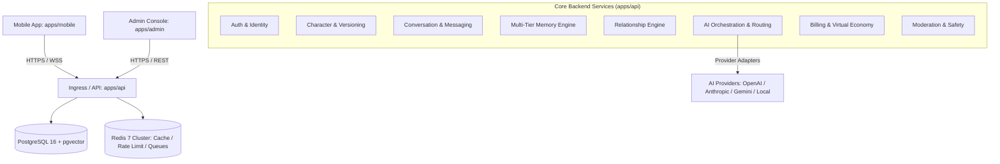

# System Architecture Specification

## 1. High-Level Architecture Overview

The AI Companion Platform is engineered as a domain-driven monorepo containing dedicated applications (`apps/api`, `apps/mobile`, `apps/admin`) and modular packages (`packages/types`, `packages/config`, `packages/validation`, `packages/ui-tokens`, `packages/api-client`, `packages/utils`).

---

## 2. Monorepo Topology & Boundaries

| Workspace Directory   | Type        | Technology                        | Purpose                                                      |
| :-------------------- | :---------- | :-------------------------------- | :----------------------------------------------------------- |
| `apps/api`            | Application | Node.js, Express, TypeScript      | Core domain API, AI Orchestrator, health endpoints           |
| `apps/mobile`         | Application | React Native CLI, TypeScript      | Native mobile companion client                               |
| `apps/admin`          | Application | Next.js 15 App Router, TypeScript | Operations, character versioning & analytics console         |
| `packages/types`      | Package     | TypeScript                        | Universal domain models & API contracts                      |
| `packages/config`     | Package     | TypeScript                        | System constants, error codes, feature flags                 |
| `packages/validation` | Package     | Zod, TypeScript                   | Ingress data schema validators                               |
| `packages/ui-tokens`  | Package     | TypeScript                        | Semantic design tokens (colors, typography, spacing, motion) |
| `packages/api-client` | Package     | TypeScript                        | Universal typed HTTP client SDK                              |
| `packages/utils`      | Package     | TypeScript                        | Pure utility functions (formatting, pagination)              |
| `infrastructure/`     | Infra       | Docker, SQL                       | PostgreSQL 16 (pgvector) and Redis 7 definitions             |

---

## 3. Core Architectural Rules

1. **Clean Domain Boundaries**: Business logic is encapsulated in isolated modules (`auth`, `characters`, `conversations`, `memory`, `relationships`, `ai`, `billing`, etc.). Modules communicate via well-defined interfaces.
2. **Asynchronous Offloading**: The interactive chat turn path handles minimal synchronous operations (auth, rate limiting, context assembly, LLM streaming). Heavy operations (semantic memory extraction, summarization) are offloaded to background queues.
3. **Decoupled AI Infrastructure**: Application logic never communicates directly with external AI SDKs. All AI requests pass through `AIOrchestrator`, which delegates to model routers and provider adapters.
4. **Resilient Streaming Protocol**: Conversational interactions support real-time token streaming with built-in reconnection, idempotency keys, and graceful degradation on packet loss.
