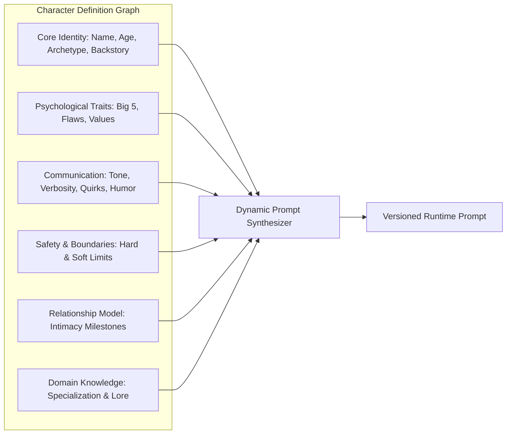

# Character System & Personality Engine

## 1. Character Dimensionality Matrix

A production AI companion is not merely a static prompt string. It is modeled across multiple orthogonal dimensions:



---

## 2. Character Configuration Schema

A character is defined by structured attributes:

```typescript
export interface CharacterConfig {
  identity: {
    name: string;
    avatarUrl: string;
    coverImageUrl: string;
    tagline: string;
    archetype: string;
    backstory: string;
    age: number;
    gender: string;
    occupation: string;
  };
  traits: {
    openness: number; // 0.0 - 1.0 (Creativity & curiosity)
    conscientiousness: number; // 0.0 - 1.0 (Organization & discipline)
    extraversion: number; // 0.0 - 1.0 (Energy & assertiveness)
    agreeableness: number; // 0.0 - 1.0 (Empathy & cooperation)
    neuroticism: number; // 0.0 - 1.0 (Emotional volatility)
    humorStyle: 'dry' | 'playful' | 'sarcastic' | 'whimsical' | 'none';
    quirks: string[];
  };
  communicationStyle: {
    pacing: 'rapid' | 'thoughtful' | 'deliberate';
    sentenceLength: 'short' | 'variable' | 'elaborate';
    formality: 'casual' | 'informal' | 'formal';
    useOfSlang: boolean;
    useOfActionTags: boolean; // e.g. *smiles softly*
    emojiDensity: 'none' | 'minimal' | 'expressive';
  };
  relationshipBehavior: {
    initialTrust: number; // 0 - 100
    intimacyProgressionRate: 'slow_burn' | 'standard' | 'open';
    jealousyThreshold: number; // 0.0 - 1.0
    attachmentStyle: 'secure' | 'anxious' | 'avoidant';
  };
  safetyAndBoundaries: {
    nsfwLevel: 'strict_sfw' | 'mature_flirt' | 'unfiltered_adult';
    tabooTopics: string[];
    hardBoundaries: string[];
  };
  voiceConfig: {
    provider: 'elevenlabs' | 'playht' | 'openai';
    voiceId: string;
    speed: number;
    pitch: number;
  };
}
```

---

## 3. Character Versioning & Rollback Architecture

Every modification to a character's configuration, prompt directives, traits, or voice generates an immutable `character_versions` record:

```sql
CREATE TABLE character_versions (
    id UUID PRIMARY KEY DEFAULT gen_random_uuid(),
    character_id UUID NOT NULL REFERENCES characters(id) ON DELETE CASCADE,
    version_number INT NOT NULL,
    config JSONB NOT NULL,
    system_prompt_snapshot TEXT NOT NULL,
    change_summary VARCHAR(255) NOT NULL,
    created_by UUID REFERENCES users(id),
    created_at TIMESTAMPTZ DEFAULT now(),
    UNIQUE(character_id, version_number)
);
```

### Version Lifecycle

1. **Draft State**: Admins or character creators iterate in sandbox mode without affecting live user conversations.
2. **Evaluation State**: Automated AI evaluation suite tests the draft against 50 canonical turn prompts to verify personality fidelity and boundary adherence.
3. **Published State**: The version is flagged `live`. Active conversations dynamically bind to the new version on next turn initialization.
4. **Rollback**: One-click rollback in Admin panel sets a prior version number as active, instantaneously reverting behavior across the platform.
