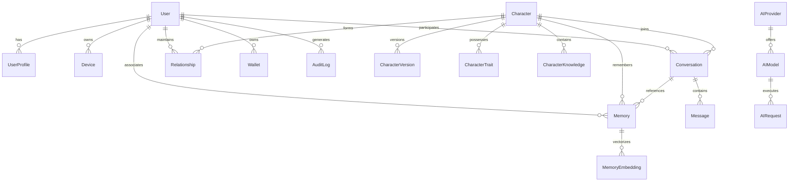

# Database Architecture & Schema Specification

## 1. Relational Foundation & Guidelines

PostgreSQL 16 is the single source of truth for the platform. It supports relational integrity, high-throughput indexing, JSONB for dynamic metadata, and `pgvector` for vector embedding similarity search.

### Design Principles

1. **Ownership & Tenant Isolation**: Every user-owned record explicitly references `user_id` with foreign key cascade or restrict rules.
2. **Deterministic Primary Keys**: UUIDv7 / CUID2 used for globally unique, time-ordered primary keys, avoiding B-Tree index fragmentation while preventing sequential ID enumeration attacks.
3. **Auditing & Timestamps**: Every table contains `created_at` (TIMESTAMPTZ, default `now()`) and `updated_at` (TIMESTAMPTZ, auto-updated).
4. **Soft Deletions**: Reserved exclusively for recoverable user-facing entities (`users`, `characters`, `conversations`, `memories`) via `deleted_at TIMESTAMPTZ NULL`. Hard deletes are executed asynchronously via GDPR cleanup policies.
5. **No Blind JSON Blobs**: Relational data (traits, versions, messages, memory links) is normalized into tables. JSONB is reserved for flexible AI configurations, prompt variable maps, and third-party webhook payloads.

---

## 2. Core Entity Relationship Diagram



---

## 3. Entity Classification & Lifecycle

| Table Group           | Primary Tables                                                                | Indexing Strategy                                                          | Lifecycle & Cleanup                                                                |
| :-------------------- | :---------------------------------------------------------------------------- | :------------------------------------------------------------------------- | :--------------------------------------------------------------------------------- |
| **Auth & Identity**   | `users`, `user_profiles`, `devices`                                           | `email` (UNIQUE), `phone` (UNIQUE), `role`, `status`                       | Soft-deletable on user account closure; 30-day purge window.                       |
| **Character Engine**  | `characters`, `character_versions`, `character_traits`, `character_knowledge` | `slug` (UNIQUE), `status`, `is_featured`, `created_by`                     | Immutable version snapshots (`character_versions`); rollbacks create new versions. |
| **Messaging**         | `conversations`, `messages`                                                   | Composite `(conversation_id, created_at DESC)`, `idempotency_key` (UNIQUE) | High write volume; paginated by cursor `(created_at, id)`.                         |
| **Memory System**     | `memories`, `memory_embeddings`                                               | `(user_id, character_id, memory_type)`, HNSW vector index on embeddings    | Auto-decayed by importance and recency score; user can purge memories.             |
| **Relationships**     | `relationships`, `relationship_events`                                        | `(user_id, character_id)` UNIQUE composite                                 | Updated incrementally via background interaction scorers.                          |
| **AI Operations**     | `ai_providers`, `ai_models`, `ai_requests`                                    | `(provider_id, model_name)`, `created_at DESC` for analytics               | `ai_requests` stores token counts & latencies; partitioned by month in high scale. |
| **System Governance** | `feature_flags`, `audit_logs`                                                 | `key` (UNIQUE), `(entity_type, entity_id)`                                 | Append-only audit trail for administrative actions.                                |

---

## 4. Vector Storage Architecture (`pgvector`)

Memory retrieval utilizes PostgreSQL's native `pgvector` extension:

- **Dimensions**: 1536 (OpenAI text-embedding-3-small) or 768 (Nomad / Google embedding models).
- **Index Type**: **HNSW (Hierarchical Navigable Small World)** with `vector_cosine_ops`.
- **Query Optimization**:
  ```sql
  -- Fast cosine similarity filtered by user and character partition
  SELECT m.id, m.content, m.importance_score, 1 - (e.embedding <=> $query_vector) AS similarity
  FROM memories m
  JOIN memory_embeddings e ON e.memory_id = m.id
  WHERE m.user_id = $user_id
    AND m.character_id = $character_id
    AND m.deleted_at IS NULL
  ORDER BY similarity DESC
  LIMIT 5;
  ```
- **Partitioning**: Filtered search on `(user_id, character_id)` ensures index traversal is constrained to the specific user-character graph, preventing global scan overhead.
