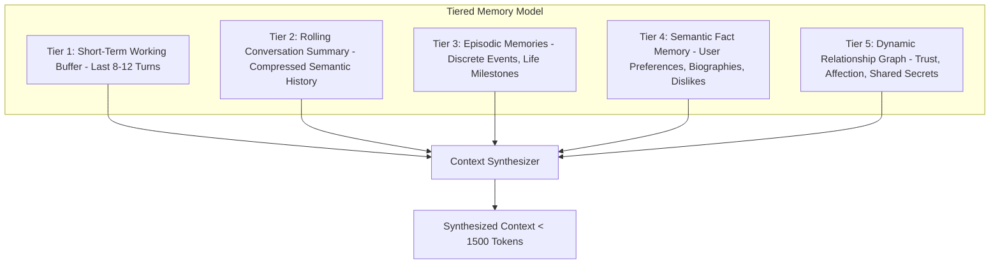
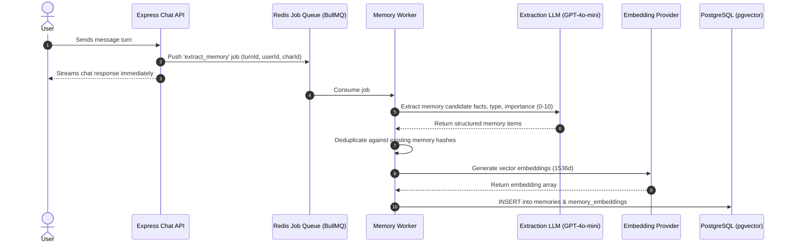

# Multi-Tier Memory Engine Specification

## 1. Multi-Tier Memory Hierarchy

Sending entire conversation histories into an LLM causes prompt token explosion, degradation of attention, and astronomical API costs. The platform implements a **5-tier hierarchical memory model**:

---

## 2. Memory Extraction & Ingestion Pipeline

Ingestion is 100% asynchronous and offloaded to background job queues (`BullMQ` on Redis) to maintain sub-second chat latency:

---

## 3. Relevance-Driven Retrieval Algorithm

When assembling the prompt for a new turn, memories are retrieved using a **hybrid scoring formula**:

$$\text{FinalScore} = w_1 \cdot \text{CosineSimilarity} + w_2 \cdot \text{ImportanceScore} + w_3 \cdot \text{RecencyDecay}$$

Where:

- $\text{CosineSimilarity} = 1 - (\vec{E}_{\text{query}} \cdot \vec{E}_{\text{memory}})$
- $\text{ImportanceScore} \in [0.0, 1.0]$ assigned by extraction LLM
- $\text{RecencyDecay} = e^{-\lambda \cdot \Delta t}$ ($\Delta t$ = days elapsed since memory was formed)
- Default weights: $w_1 = 0.55, w_2 = 0.30, w_3 = 0.15$

### Context Window Injection Limits

- Maximum retrieved episodic/semantic memories per turn: **5 items**.
- Maximum token budget for memory block in system prompt: **400 tokens**.
- Irrelevant memories (FinalScore < 0.65) are automatically discarded to prevent prompt pollution.
