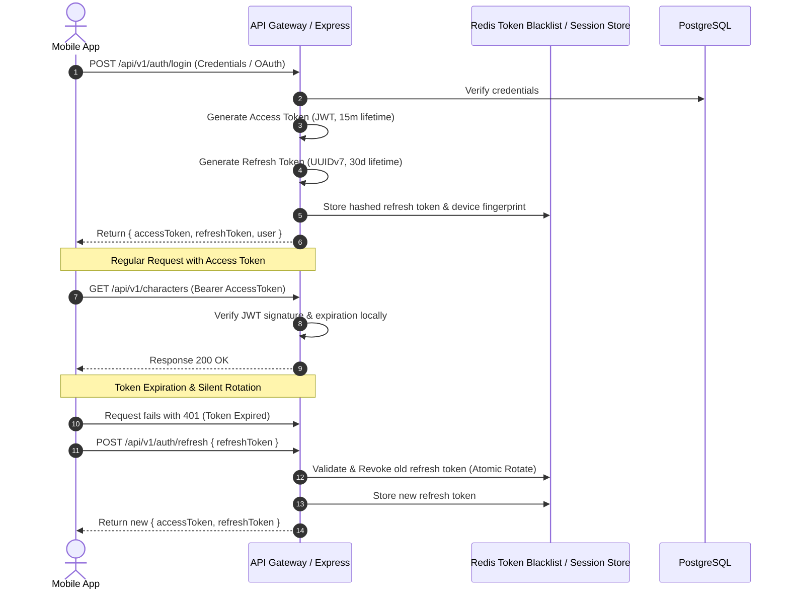

# Security, Privacy & Compliance Architecture

## 1. Authentication & Token Lifecycle

The platform uses a secure dual-token architecture:

---

## 2. Authorization & Role-Based Access Control (RBAC)

Roles:

- `USER`: Standard consumer; access only to own profile, owned conversations, memories, wallets.
- `CREATOR`: Can create, test, and publish custom characters (subject to platform moderation).
- `MODERATOR`: Can review flagged conversations, review moderation queues, soft-ban abusive users.
- `ADMIN`: Full access to admin console, AI routing, financial analytics, prompt version rollbacks, feature flags.

Enforcement:

- Express middleware `authorize(['ADMIN', 'MODERATOR'])` guards all privileged endpoints.
- Row-level access control enforced in domain services ensuring `userId` from verified JWT matches queried records.

---

## 3. Threat Mitigation Matrix

| Vulnerability / Threat            | Mitigation Strategy                                                                                                                                                                                                                              |
| :-------------------------------- | :----------------------------------------------------------------------------------------------------------------------------------------------------------------------------------------------------------------------------------------------- |
| **Prompt Injection / Jailbreaks** | - Pre-generation intent & boundary classifier. - Structural prompt separation: System rules isolated in `<system_instructions>` boundaries with override disclaimers. - Post-generation safety validation before streaming terminal chunk. |
| **DDoS / API Abuse**              | - Redis sliding-window distributed rate limiting (IP-level and authenticated user-level). - Cloudflare / WAF ingress rules. - Strict JSON payload size limits (100KB for text, 10MB for media upload).                                     |
| **Credential Theft / XSS**        | - Mobile tokens stored in OS Keystore (Android) / Keychain (iOS). - HTTP-only, secure, SameSite cookies for administrative web console. - Helmet middleware setting strict CSP, HSTS, and X-Content-Type headers.                          |
| **Secret Exposure**               | - Environment variables parsed and validated strictly via `zod` at boot. - Never return raw errors or database stack traces in client response envelopes.                                                                                     |

---

## 4. Privacy & Data Governance (GDPR / CCPA)

1. **Right to Erasure (Account Deletion)**:
   - User triggers deletion: Account enters 30-day soft-deleted state.
   - Anonymized purge job deletes all messages, vector embeddings, and relationship logs; retains only anonymized financial transaction ledger for tax compliance.
2. **Right to Memory Management**:
   - Users can view and selectively delete individual remembered facts in settings.
   - Deleting a memory cascades to soft-delete the associated `memory_embeddings` vector.
3. **Zero Third-Party Training**:
   - Enterprise agreements / API zero-data-retention flags enabled with AI providers (OpenAI, Anthropic) ensuring user conversation turns are not used for foundation model training.
