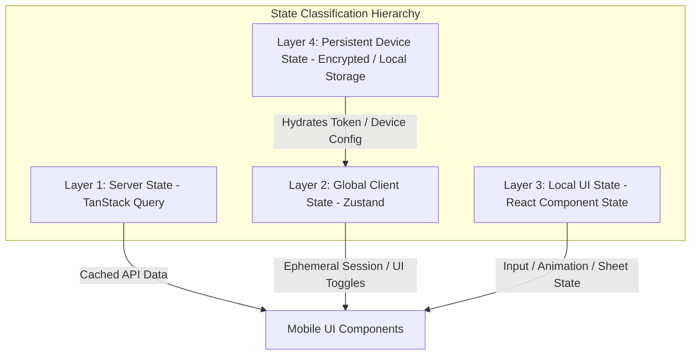

# State Management Architecture & Conventions

## 1. Core Principles & Philosophy

A common anti-pattern in mobile engineering is conflating server cache with client UI state in a monolithic store (e.g. putting entire database payloads into Redux/Zustand).

In this application, state is strictly classified into **four discrete layers**:



---

## 2. Layer Definitions & Boundaries

### Layer 1: Server State (Managed by `@tanstack/react-query`)

- **Characteristics**: Asynchronous, owned remotely by the backend database, shared across devices, potentially stale.
- **Allowed Scope**:
  - Character catalogs, character details, character versions.
  - User profiles, user subscription status, wallet balances.
  - Conversation histories, message paginations.
  - Memory logs, relationship levels, gift catalogs.
  - Notification lists.
- **Rules**:
  - **NEVER** duplicate server state into Zustand stores.
  - Always use query keys adhering to strict hierarchical conventions: `['characters', id]`, `['conversations', convId, 'messages', { cursor }]`.
  - Use optimistic mutations for messaging with rollback on network failure.
  - Set explicit `staleTime` and `gcTime` per resource domain (e.g., character profile: `staleTime: 5 mins`; message stream: `staleTime: 0`).

### Layer 2: Global Client State (Managed by `zustand`)

- **Characteristics**: Synchronous, client-local, shared across multiple disconnected screens/components, transient across sessions.
- **Allowed Scope**:
  - Active authenticated session metadata (JWT expiration, active user ID).
  - Global app preferences (active theme override: system/dark/light, audio playback volume).
  - Global modal / sheet coordinator (which global action sheet is open).
  - Network connectivity banner status.
- **Rules**:
  - Stores must be atomic, feature-scoped, and slice-based (`useAuthStore`, `useSettingsStore`, `useUIStore`).
  - Zero server entity caching in Zustand.

### Layer 3: Local UI State (Managed by React `useState` / `useReducer` / `useRef`)

- **Characteristics**: Scoped strictly to the lifecycle of a single component or screen.
- **Allowed Scope**:
  - Chat text input buffer.
  - Form validation states (via `react-hook-form`).
  - Dropdown / accordion toggle states.
  - Gestures and animation values (via `react-native-reanimated`).
  - Scroll positions and virtual list offset tracking.
- **Rules**:
  - If state is not needed outside the component or its immediate children, keep it local.

### Layer 4: Persistent Device State (Managed by Secure Storage / MMKV)

- **Characteristics**: Survives app restarts, stored on device disk/keychain.
- **Allowed Scope**:
  - Auth Access & Refresh Tokens (in encrypted Keychain/Keystore).
  - Onboarding completed flag.
  - Selected language / locale.
  - Biometric preference flags.
- **Rules**:
  - Do not persist large blobs or chat histories locally unless building an explicit offline mode.

---

## 3. Query Key Convention Matrix

| Domain               | Query Key Factory Pattern                           | Stale Time    | Cache Time (gcTime) |
| :------------------- | :-------------------------------------------------- | :------------ | :------------------ |
| **Auth User**        | `['auth', 'me']`                                    | 10 mins       | 30 mins             |
| **Character List**   | `['characters', { filter, page }]`                  | 5 mins        | 20 mins             |
| **Character Detail** | `['characters', characterId]`                       | 5 mins        | 30 mins             |
| **Conversations**    | `['conversations', { status }]`                     | 1 min         | 15 mins             |
| **Messages**         | `['conversations', convId, 'messages', { cursor }]` | 0s (realtime) | 10 mins             |
| **Relationship**     | `['characters', characterId, 'relationship']`       | 2 mins        | 15 mins             |
| **Wallet & Credits** | `['billing', 'wallet']`                             | 30s           | 10 mins             |

---

## 4. Chat State Machine

The active chat experience uses a deterministic state machine per message / turn:

```text
[IDLE]
  │
  ├─► (User sends message) ──► [SENDING] (Optimistic message inserted)
  │                                │
  │                                ├─► (Network error) ──► [FAILED] (Retryable)
  │                                │
  │                                └─► (HTTP 200 / Stream Init) ──► [STREAMING]
  │                                                                     │
  │                                                                     ├─► (Stream interrupted) ──► [INTERRUPTED]
  │                                                                     │
  │                                                                     └─► (Stream finished) ──► [COMPLETED] ──► [IDLE]
```

- Each state is reflected in the UI via micro-typography and animated status cues (not noisy generic emojis).
