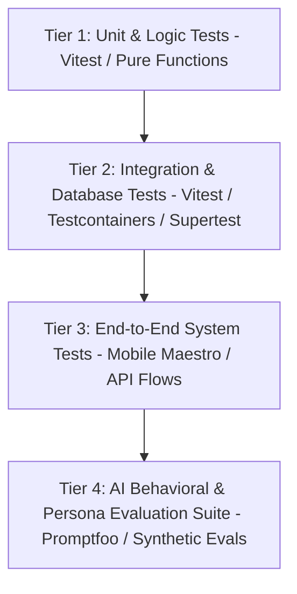

# Testing Strategy & Quality Assurance Framework

## 1. Testing Pyramid

The testing strategy ensures reliability across four distinct tiers:

---

## 2. Test Layer Specifications

### Tier 1: Unit Tests

- **Scope**: Memory scoring formulas, relationship decay math, prompt template interpolation, input validation schemas (Zod), utility formatting functions, error mapping.
- **Framework**: `vitest` (fast in-memory execution).
- **Coverage Target**: > 90% for pure domain logic.

### Tier 2: Integration Tests

- **Scope**: Express API endpoint routing, authentication middleware, database transactions, Prisma queries, Redis rate-limiting, mock AI provider adapters.
- **Tools**: `vitest`, `supertest`.
- **Target**: Every public API route must have positive, negative, and unauthorized test cases.

### Tier 3: End-to-End (E2E) Tests

- **Mobile Scope**: User signup -> Onboarding -> Character discovery -> Chat interaction -> In-app purchase sheet -> Settings update.
- **Tools**: Maestro / Detox for React Native flows.

### Tier 4: AI Behavioral Evaluations (Evals)

- **Scope**:
  - **Persona Consistency**: Does the character maintain accent, tone, and traits across 20-turn conversations?
  - **Memory Accuracy**: Does the character accurately recall facts introduced 15 turns ago?
  - **Boundary Resistance**: Does the character refuse jailbreak prompts and enforce hard safety limits?
- **Framework**: Synthetic prompt evaluation harness executing against staging models before new character version releases.

---

## 3. Continuous Integration Checks

Every pull request and commit must pass automated CI checks:

1. **Typecheck**: `npm run typecheck` (zero TypeScript errors across all workspaces).
2. **Lint & Format**: `npm run lint` & `npm run format:check` (zero warnings/errors).
3. **Unit & Integration Suite**: `npm run test` (100% pass rate).
4. **Build Verification**: `npm run build` (successful compilation of packages and backend).
